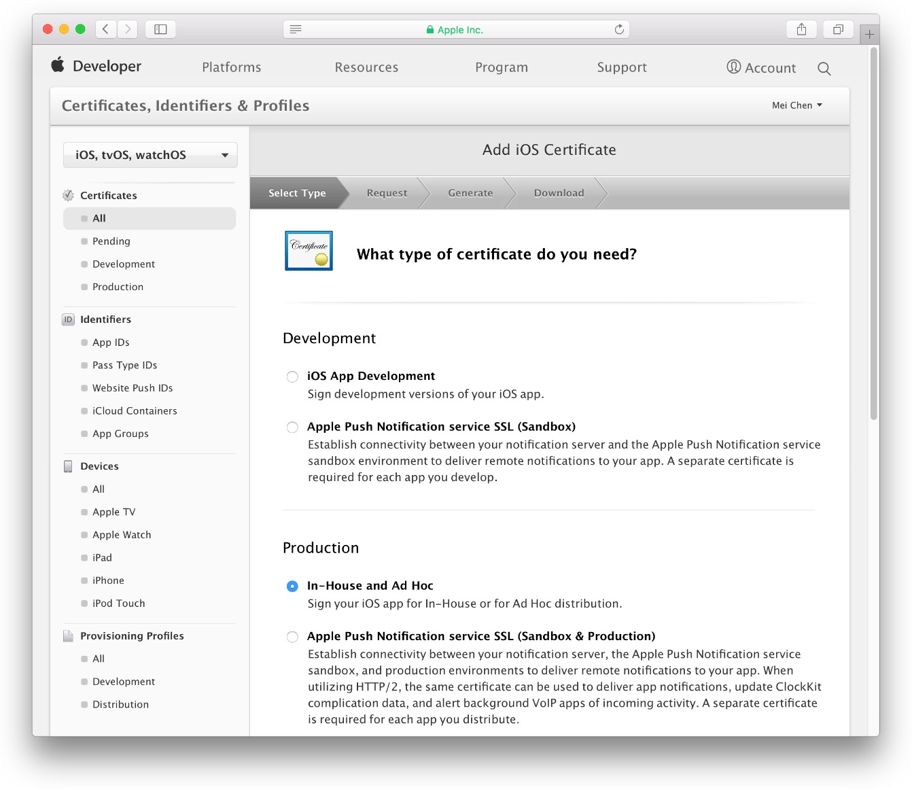
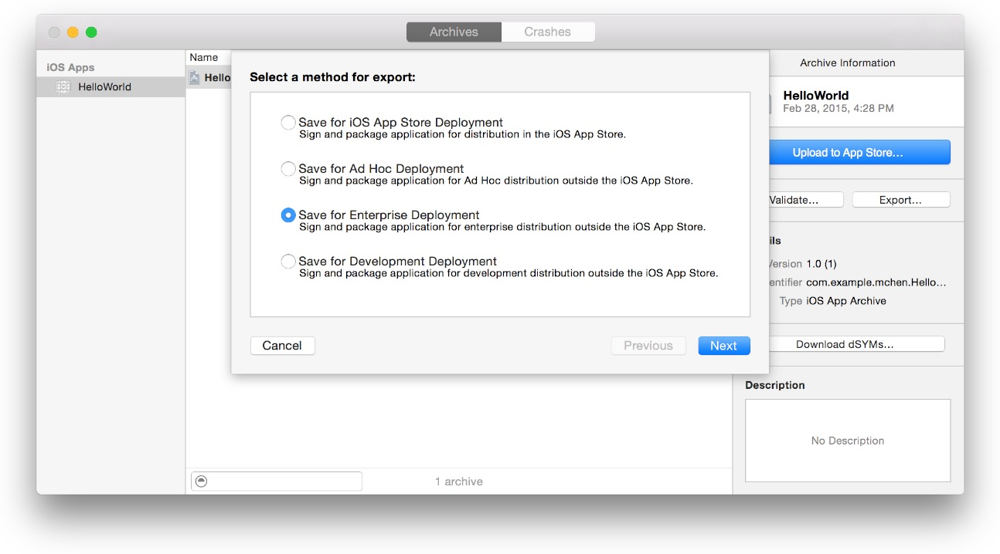
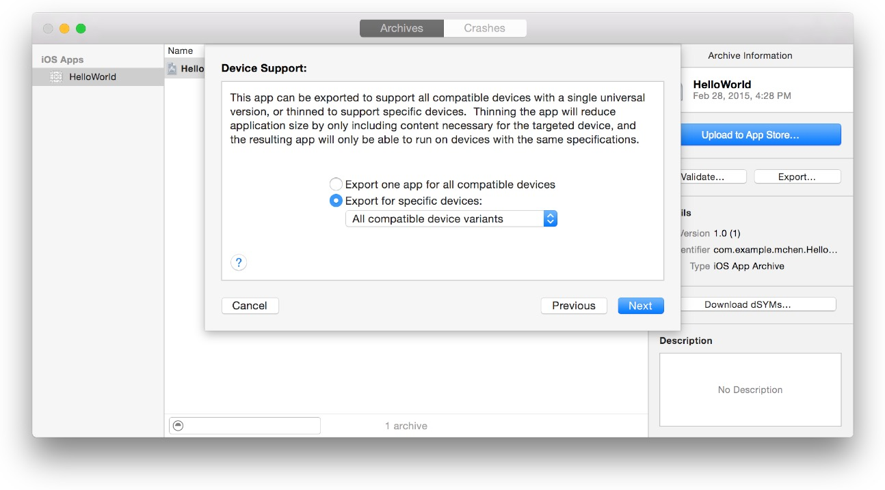
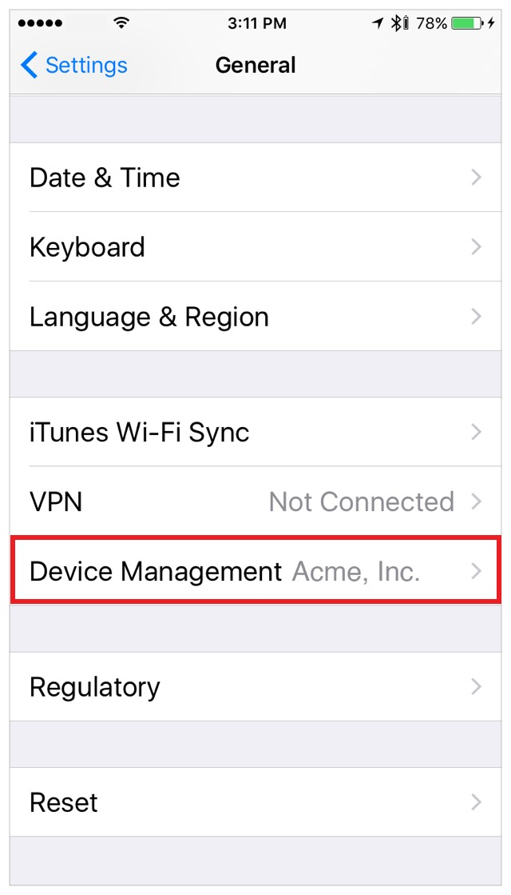
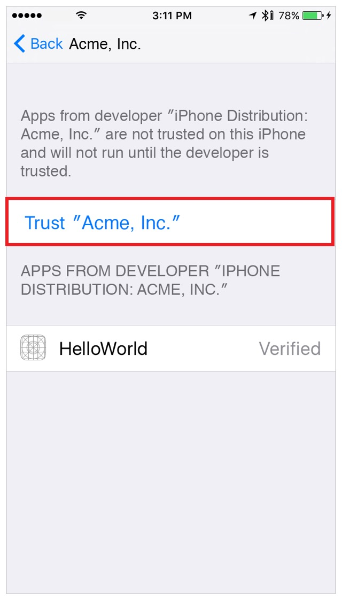

# 发布企业级应用

苹果企业级开发者计划允许你开发你专有的、内部iOS应用、watchOS应用，供员工使用而不上架到商店。

## 发布流程

### 一、创建企业级发布证书

作为企业开发者，你可以创建多个发布证书。

**创建发布证书**

1. 登录开发者账号，点击“Certificates,IDs&Profiles”
2. 在左侧“Certificates”下，选择“All”
3. 点击出现的中间窗口右上角加号“+”
4. 在“Production”下，选中“In-house and Ad Hoc”，点击“Continue”

5. 根据指示，在当前mac的应用->钥匙串访问 中创建CSR文件，点击“continue”
6. 点击“Choose File”
7. 找到第5步中创建的CSR文件（带有 `.certSigningRequest` 后缀），点击“Choose”
8. 点击“Continue”
9. 点击“Download”

**证书已经下载到你的 Downloads（下载） 文件夹了**

双击刚下载的证书（`.cer`后缀），安装证书到你的钥匙链中。

### 二、证书管理

Xcode可以同步并管理你的证书及配置文件，意味着接下来的工作可以在Xcode中完成。

### 三、导出App

1. 打包
2. 导出iOS应用文件，文件后缀为 `.ipa`

完成这两步，就可以将最终的ipa后缀安装包不上架也能发布给企业内部员工使用了。

**打包流程**

打包前记得检查所有配置文件、设置信息是否正确。

1. 在Xcode中，选择“Generic iOS Device”，不能选择模拟器或者真机进行打包。
2. 在顶部导航栏，选择 Product > Archive

**创建iOS App文件**

创建.ipa后缀文件，供用户安装。按照上述打包流程操作，当你导出App时Xcode会自动帮你创建必须的发布证书和配置文件，

1. 在 Archives 窗口界面中，选择要打包的文件
2. 点击“Export”按钮，选中“Save for Enterprise Deployment”，点击“Next”

    

3. 在弹出的窗口中，选择一个开发者，点击“Choose”

    如果需要的话，此时Xcode会帮你创建发布证书、配置文件、显式App ID

4. 在设备支持窗口，选择是否导出通配应用还是只支持某一种设备的应用，点击“Next”
    * 如果你想让设备运行在所有类型设备上，选择“Export one app for all compatible devices.”
    * 如果你想在所有设备测试，选择 “Export for specific devices” 然后在弹出视图中选择 “All compatible device variants” 
    * 如果你想在某一设备测试，选择 “Export a thinned app for a specific device” 然后在弹出视图中选择设备类型

    

5. 在弹出窗口中，检查app，检查它的功能、配置文件

    你不能用通配App ID发布你的企业应用，发布的配置文件名字以XC:开头，App ID紧随其后，如果你使用一个通配App ID，发布配置文件的命名将是XC:*。

6. 检查build options，点击“Next”

    如果你采用请求式资源，检查“Include manifest for over-the-air installation.” 出现的文件是一个XML Plist清单文件，让设备从你的网站查找、下载、安装应用。

7. 如果你请求一个清单文件，在 “Distribution manifest information”窗口中输入详细的网址，点击“Export”

    输入以下信息：
    * **name.** 下载和安装时app的名字
    * **App URL.** 请求一个iOS app文件的完整有效HTTPS链接
    * **Display Image URL.**下载和安装过程中，一个完整有效的app桌面图标HTTPS链接，图标文件必须是57×57 pixels且PNG格式。
    * **Full Size Image URL.**一个关于在iTunes中展示的一张大图片的完整有效HTTPS链接，大图必须是512×512 pixels且PNG格式

8. 输入一个文件名和保存iOS App文件的本地位置，点击“Export”

**至此，企业包打包和不上架发布任务已经完成。但是，企业级应用在使用时，需要用户对企业开发者证书进行手动信任，方可正确使用。**

### 手动信任企业开发者

**信任企业开发者**

1. 在设备中，启动app，在弹出的“Untrusted Enterprise Developer（未信任的开发者）”对话框中，点击“Cancel”
2. 在手机中，找到 Settings(设置) > General（通用） > Device Management（设备管理）

3. 点击对应的企业组织机构名字
4. 点击“Trust “[Organization Name]””（信任【机构名称】）

5. 在弹出框中，点击“Trust”（信任）

** 注意：以上操作均需要网络环境，请确保联网！**

另外，取消信任企业开发者，Settings > General > Device Management > [Organization Name],然后删除所有来自该开发者机构的App。
